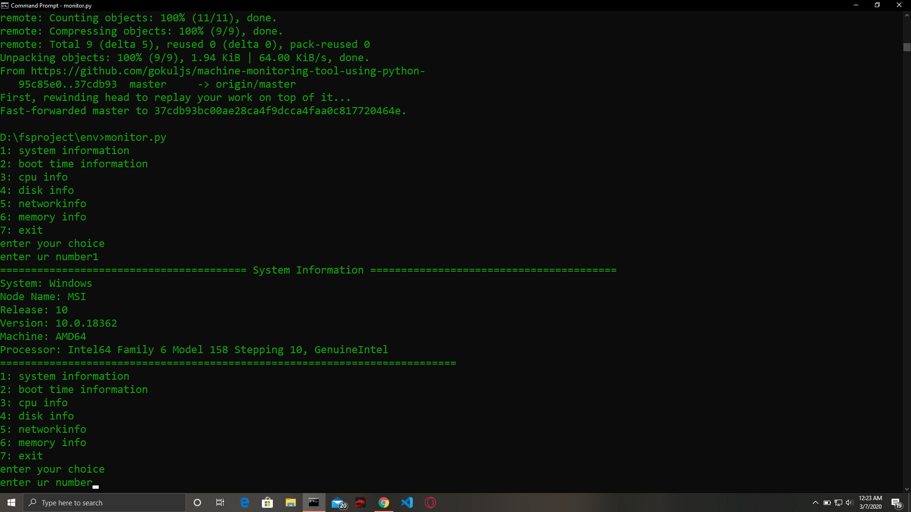
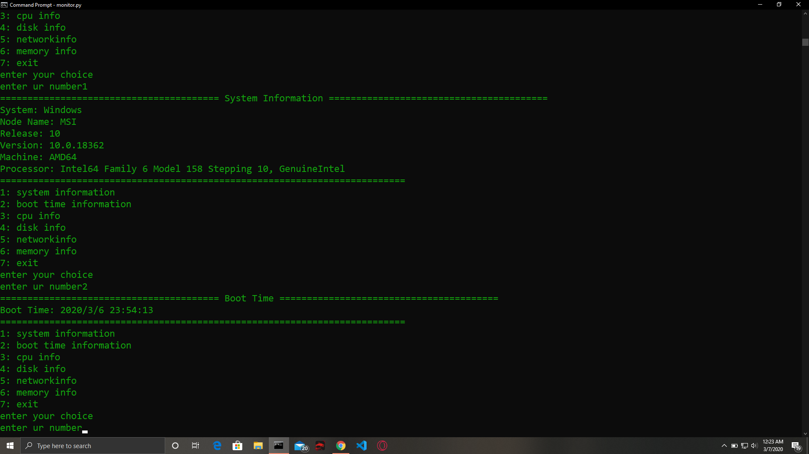
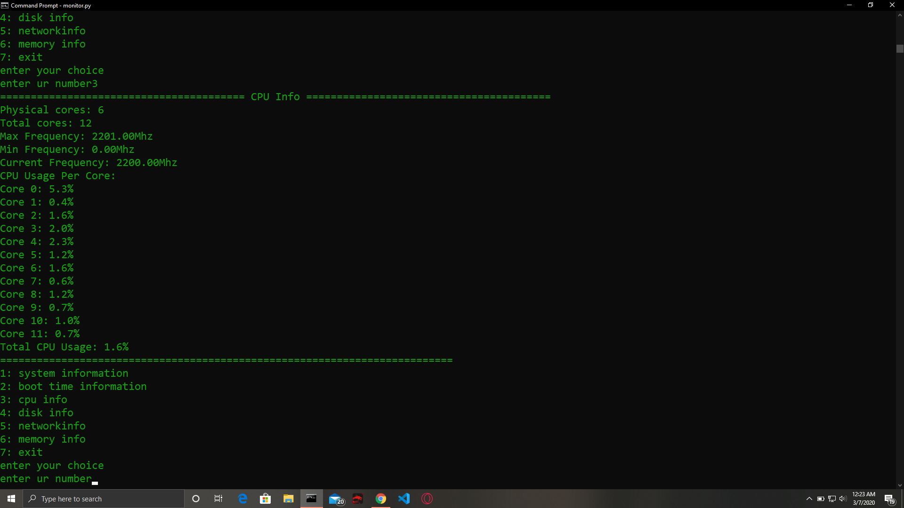
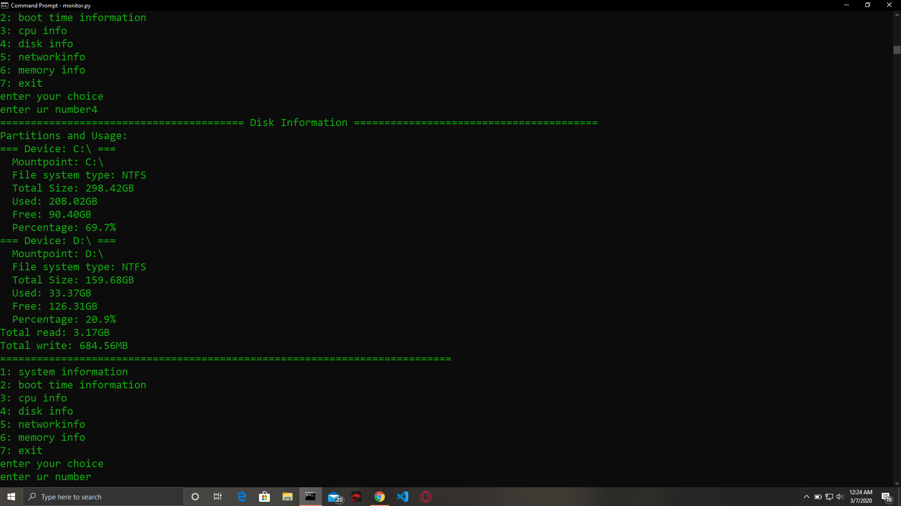
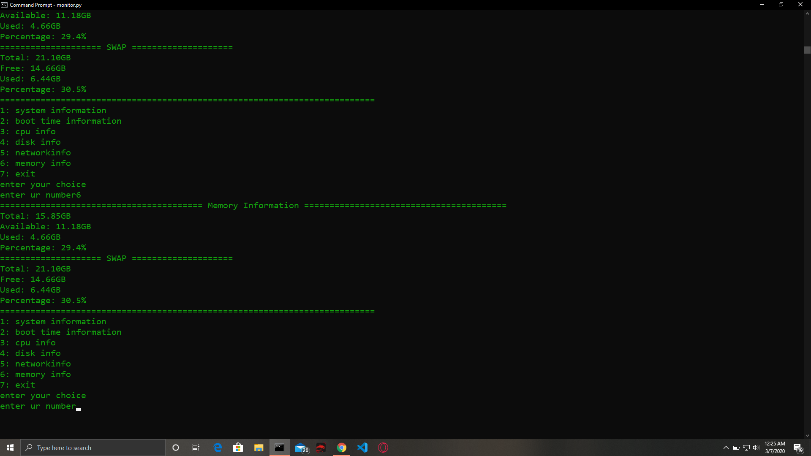
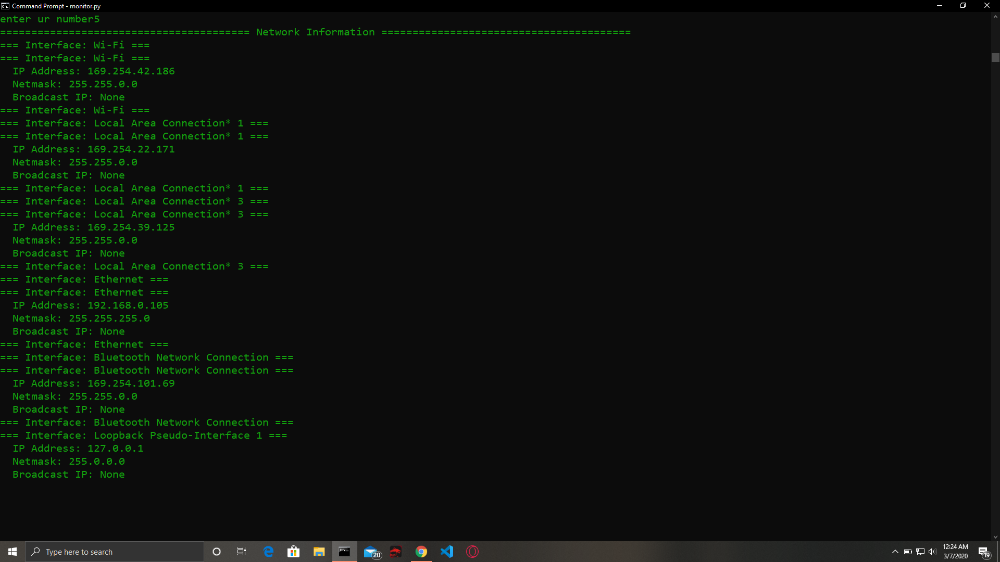

# machine-monitoring-tool-using-python-
## Documentation

https://psutil.readthedocs.io/en/latest/

## installation
1: https://www.python.org/downloads/   \n
2: install pip      \n
3: install package called psutil (pip install psutil)

### systeminfo

### boottime

### cpuinfo

### diskinfo

### memoryinfo

### networkinfo

